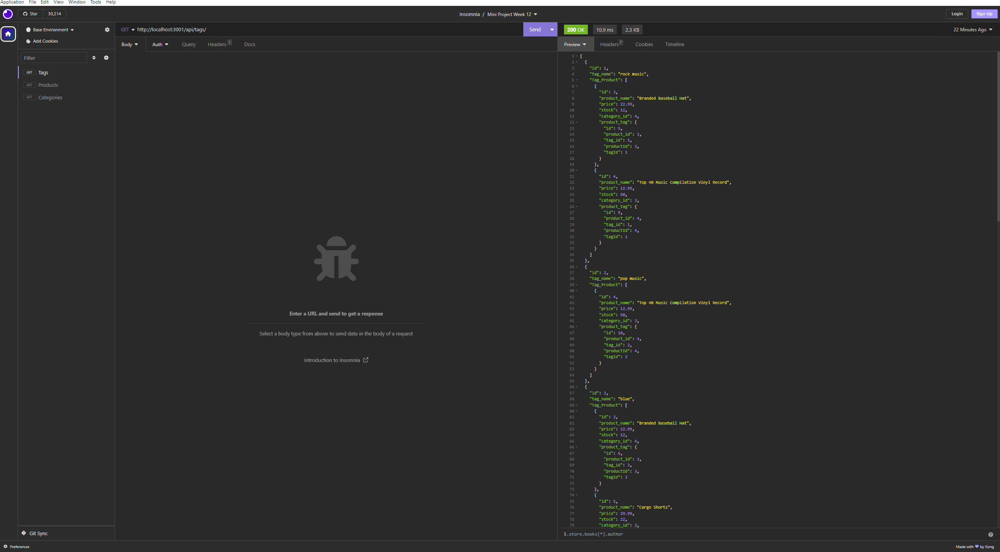

# E-Commerce Platform (Module 13)

## Description
A web application built with Express.js and Sequelize ORM that allows users to manage product categories and their associated products.

Walkthrough video: https://drive.google.com/file/d/1oDG6MR0NGM4ZKlG4xEofDuZsVlsUYKZH/view

### Credits
Completion of the project was done with the help of Tutors
